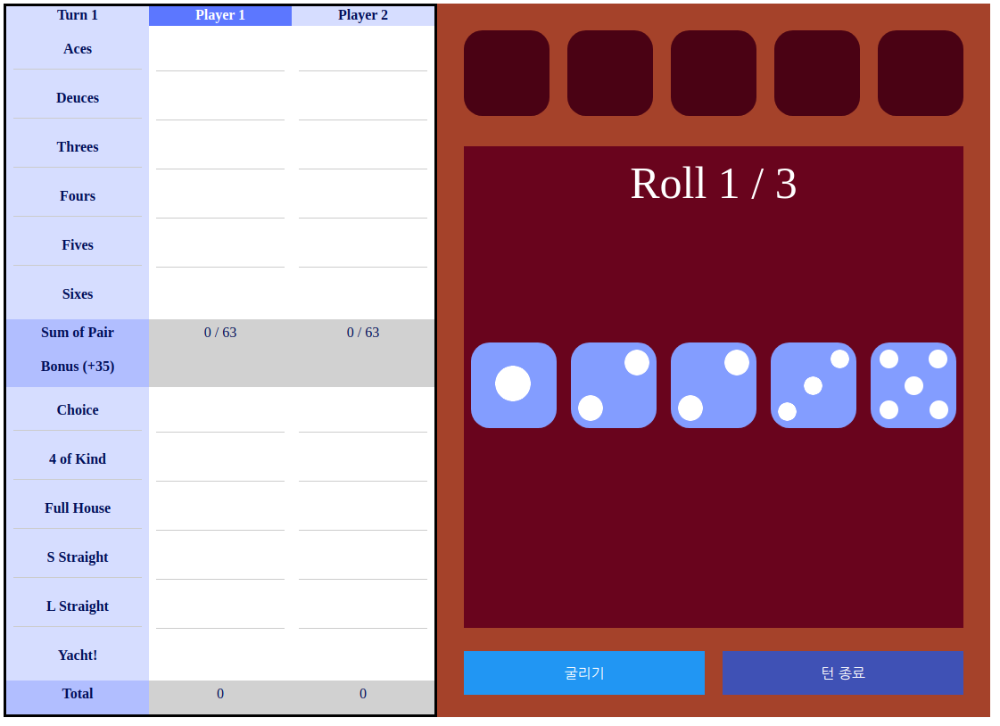
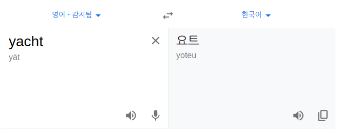

# YachtVue

Vue 개발용으로 만든 Yacht 입니다.
닌텐도 51 Worldwide Games에 있는 것과 동일한 룰입니다.
별 다른 책 없이 혼자 짜본거라 좀 많이 난잡합니다.

stateMachine을 써서 단기적(phase), 장기적 흐름(gameflow)를 나눈 건 좋았는데 state 검사 부분을 문자열이랑 비교한건 지금 생각해도 너무 대충 짠 것 같습니다.
간단한 게임이니 gameManager를 안 쓰고 함수의 흐름으로 가던가, 엄밀하게 여러 개의 manager로 쪼개던가 해야했는데, 결국 이도저도 아니게 된 것 같습니다. gameManager는 적어도 class로 만들어야 했을 것 같습니다.

그 밖의 단점이 많이 있지만, 자동완성도 없는 환경에서 처음 쓰는 프레임워크를 활용해 무사히 개발을 마쳤다는 것이 개인적으로 맘에 듭니다. 프론트엔드로 거창한 것을 만들어본 적이 없었는데, css 애니메이션도 써보고, js로 비동기 함수 써서 주사위 좌라락하는 것도 구현하고, 각종 배열 메소드 접해보고, vue에서 이벤트 핸들링이랑 컴포넌트 익혀보고, 좋은 기회였다고 생각합니다.

---
  
그건 그렇고 왜 사람들이 야추로 부르는지 모르겠습니다. 애초에 스펠링에도 U가 없잖아요.